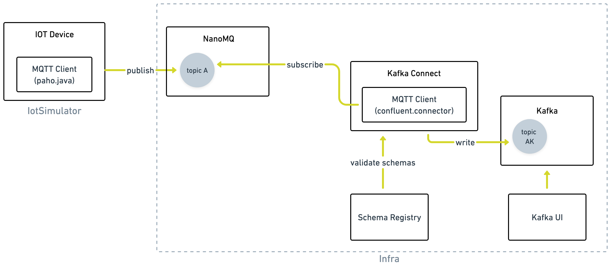

# Iot Data Streaming flow

This repository presents a solution for streaming IoT data into a distributed event streaming platform.



The solution leverages the MQTT protocol to transmit data from IoT devices to an internal engineering infrastructure. Devices publish data to an MQTT broker (NanoMQ), which Kafka Connect subscribes to in order to ingest the data into Kafka. During this process, the Confluent Schema Registry is used to validate message schemas.


## How to run

There are two components for the solution as you can see in the above diagram in grey colouring with the same namings as the folders in this project. The infra uses docker to locally run its components. To start it run:

```
docker compose build
docker compose up
```

For the IotSimulator I suggest that you import the code into a [Android Studio](https://developer.android.com/studio) project.

I also suggest that you have a MQTT Client Toolbox like [MQTTX](https://mqttx.app/) to easily test and debug the data flow using the MQTT protocol.

### Create connector

Once the system is up and running, you need to create a Kafka Connect connector to subscribe to the MQTT broker and read data into a Kafka topic.

For this, I use the open-source [Confluent MQTT Connector](https://docs.confluent.io/kafka-connectors/mqtt/current/index.html), which I have added to my Kafka Connect container.
I suggest that you use the Kafka UI available at localhost:8080 to create the connector with the following configuration :


```
{
	"connector.class": "io.confluent.connect.mqtt.MqttSourceConnector",
	"mqtt.qos": "1",
	"value.converter.schema.registry.url": "schemaregistry0:8085",
	"confluent.topic.bootstrap.servers": "kafka1:29092",
	"tasks.max": "1",
	"confluent.topic.replication.factor": "1",
	"name": "source-mqtt",
	"mqtt.topics": "mqtt_topics_to_subscribe",
	"kafka.topic": "[kafka_topic_to_send_data_to]",
	"mqtt.server.uri": "tcp://nanomq:1883"
}
```
### Create schema

To validate the message schema received through the connector, I enable the Confluent Schema Registry. Therefore, we need to create the schema in the registry to ensure proper validation. The proposed message example has the following schema, which needs be added to the registry.  This can be done, for example, using the Kafka UI.

```
{
  "type": "record",
  "name": "mqtt-to-kafka-value",
  "doc": "the documentation for the messages",
  "fields": [
    {
      "name": "greeting",
      "type": "string",
      "doc": "greet"
    },
    {
      "name": "language",
      "type": "string",
      "doc": "en, pt"
    }
  ]
}
```

### Send messages from the IOT Device

Run the simulator and click the button in the top left corner of the screen to publish the message to the broker. At this stage, you can use MQTTX to subscribe to broker topics and monitor the incoming messages.

### Check messages in Kafka

Check in the Kafka UI the messages that arrived to the selected topic.